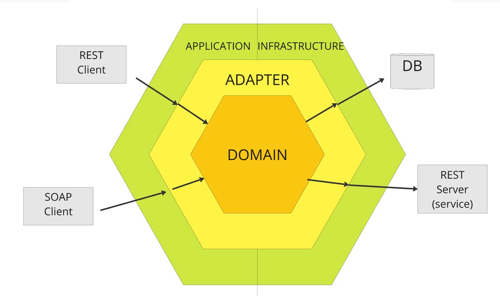

# Fast Food

Projeto desenvolvido para fins academicos do curso de Pós Graduação em Architetura de Softeware pela FIAP.
Trata-se de um serviço backend desenvolvido em Typescript para controle de pedidos e clientes para uma lanchonete fast-food. 

## Arquitetura do Projeto

Como parte do desafio, este projeto foi construído com a **Arquitetura Hexagonal** (Ports and Adapters), aplicando os conceitos aprendidos durante as aulas.

### Estrutura do Projeto

#### **Domain** (Centro do Hexágono)
Camada que encapsula o domínio, seus modelos e regras de negócio.
- **entities**: Contém os schemas das entidades de domínio, preservando-as das interferências das camadas externas.
- **interfaces**: Agrupa as interfaces para manipulação das entidades do domínio, garantindo coesão e flexibilidade.
- **usecases**: Embora ainda não utilizada devido à simplicidade atual do projeto, esta camada abrigará as funções de aplicação das regras de negócio no domínio.

#### **Application** (Atores Condutores)
A camada mais externa à esquerda do hexágono, responsável por receber inputs do ambiente externo e acionar a execução de ações.
- **http**: Contém as estruturas e arquivos para lidar com requisições HTTP.
  - **middlewares**: Implementa validações de payload e retorna erros para contratos que não atendem aos requisitos dos endpoints.
  - **requests**: Define os schemas para payloads das requisições HTTP, centralizando-os em `schemas` para validações.
  - **responses**: Define os schemas para respostas HTTP, garantindo consistência nas respostas ao cliente.
  - **controllers**: Define e manipula as rotas HTTP, realizando a comunicação com as camadas de infraestrutura (atores conduzidos) e domínio para responder às solicitações dos clientes.

#### **Infrastructure** (Atores Conduzidos)
Camada mais externa à direita do hexágono, sendo responsável pela comunicação com componentes externos, como bancos de dados e serviços.
- **database**: Estrutura organizacional para manipulação e definição do banco de dados.
  - **models**: Define os schemas das tabelas do banco de dados.
  - **repositories**: Implementa funções para consultas e manipulação de dados no banco.
  - **migrations**: Arquivos para o componente Sequelize, responsável pela criação e atualização das tabelas.

#### **Adapters** (Camada Intermediária)
Responsável pela transformação e adaptação de schemas, de acordo com as especificações das diferentes camadas, permitindo uma comunicação fluida entre as partes do sistema.



## Tecnologias Utilizadas
- Node.js
- TypeScript
- PostgreSQL
- Express
- Sequelize
- AJV (para validações)
- Docker
- Swagger

## Decisões Técnicas

- **Lógicas da Aplicação**: Executadas na camada `controller`, promovendo um fluxo direto de manipulação de dados.
- **Lógicas de Negócio**: Concentram-se na camada de `usecases` (dentro do `domain`), visando uma divisão clara entre regras de negócio e lógicas de aplicação.
- **Uso de Bibliotecas Auxiliares**: Evitou-se a utilização excessiva de bibliotecas externas (como validadores de email e CPF) para manter a leveza do projeto. Em um cenário real, tais validações seriam necessárias para garantir a integridade dos dados.
- **Foco no MVP**: Este projeto está em fase inicial, focado em um MVP (Minimum Viable Product). Considerações como escalabilidade e concorrência não foram abordadas, mas são pontos futuros.
- **Filas e Gerenciamento de Pedidos**: Assumiu-se que o gerenciamento dos pedidos será manual, e o status de um pedido deverá ser atualizado via solicitação HTTP (endpoint `PATCH /orders/:id`).
- **Operações de Exclusão**: Optou-se por fazer o delete logico atraves do atributo `deletedAt` para não adicionar complexidade extra nessa atapa do projeto.


# Getting Started

## Pre-requisitos
- Docker

## Executando via Docker
1. Para iniciar a aplicação, configurar o banco de dados e criar as tabelas necessárias, execute o seguinte comando no diretório raiz do projeto:
```bash
docker-compose up
```
A aplicação roda na porta 3000.

2. Para parar a aplicação:
```bash
docker-compose down
```

## Testando os Recursos Disponíveis

1. **Contratos via REST**: Os contratos das APIs podem ser conferidos e testados através do `Swagger`. Para acessá-lo, basta abrir o navegador e acessar a rota: `/api-docs` (http://localhost:3000/api-docs).

   Isso permitirá visualizar todos os endpoints disponíveis, além de testar as requisições diretamente pelo Swagger UI, facilitando o entendimento e validação dos contratos da API.